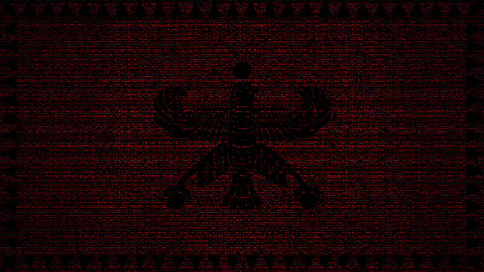

*Dorood.* ML Master's student at the University of Tübingen and ML Engineer at Heimat Software GmbH. B.Sc. in Computer Science with a minor in Mathematics from Sabancı University.

Co-founded the first [AI Club](https://kaisabanci.com/) at Sabancı University. Co-authored a paper accepted at [ICML 2024](https://icml.cc/virtual/2024/39024) with Yale University. Former data scientist at Buluttan (renewable energy forecasting, Istanbul).

[Website](https://kouroshksh.github.io) · [GitHub](https://github.com/KouroshKSH) · [LinkedIn](https://linkedin.com/in/kouroshsharifi) · [Medium](https://medium.com/@kourosh.sharifi) · [Google Scholar](https://scholar.google.com/citations?user=xSJ_bIYAAAAJ&hl=en) · [CV](https://drive.google.com/drive/folders/1QEZ-ZxnaxAHb7byMuFl8u97vk6nPfA84?usp=drive_link) · [Linktree](https://linktr.ee/kourosh.sharifi)

`Python` · `C++` · `Java` · `LaTeX` · `Linux` · `Git` · `Jupyter` · `Obsidian`
