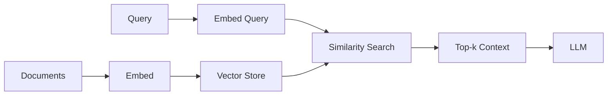

# Embeddings and Retrieval

Embeddings map discrete tokens (or documents) into continuous vectors where semantic similarity becomes geometric proximity. They connect [[attention-mechanisms|Attention Mechanisms]] outputs to practical systems like search and RAG.

## Retrieval Pipeline

## When to Fine-Tune

> [!note] Domain-Specific Embeddings
> Off-the-shelf models work for general text. For specialized domains (legal, medical, Ottoman script), fine-tuning or training a domain tokenizer often beats prompt engineering alone.

Common approaches:

- Contrastive learning on (query, relevant doc) pairs
- Hard negative mining in batch
- Matryoshka / truncated dimensions for latency trade-offs

## Link Back

This note sits in a small graph with [[transformer-architecture|Transformer Architecture]] and [[attention-mechanisms|Attention Mechanisms]]. Toggle the **graph view** in the sidebar to see how they connect.

← [[writing/index|All writing]]
