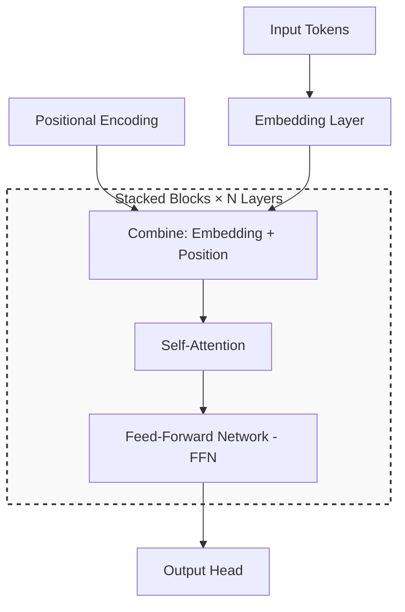

# Transformer Architecture

Transformers replaced recurrence with self-attention and became the default backbone for language, vision, and multimodal models.

Before diving into details, read my note on [[attention-mechanisms|Attention Mechanisms]] — it covers the core operation everything else builds on. For how representations are stored and searched, see [[embeddings-and-retrieval|Embeddings and Retrieval]].

## Why Transformers Won

> The key insight is parallelizable sequence modeling: every token can attend to every other token in one pass, which maps cleanly to modern hardware.

1. **Self-attention** replaces fixed receptive fields with content-based routing
2. **Positional information** is injected (sinusoidal, learned, or RoPE)
3. **Stacked blocks** of attention + feed-forward with residual connections and normalization

## Stack at a Glance

## Related

- [[attention-mechanisms]]
- [[embeddings-and-retrieval]]

<- [[writing/index|All writing]]
